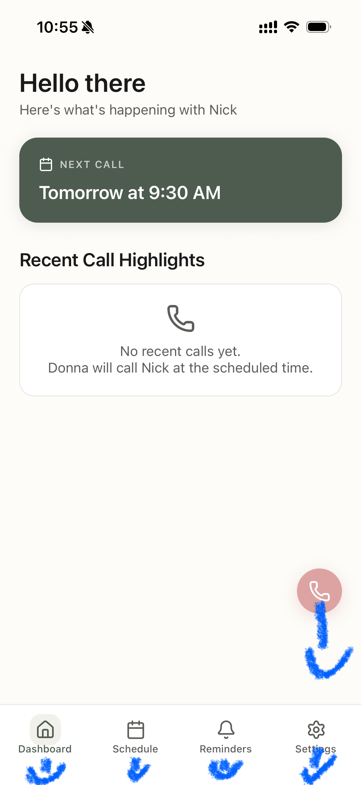
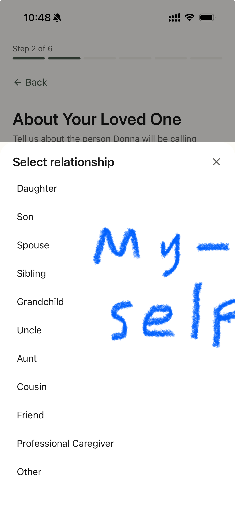
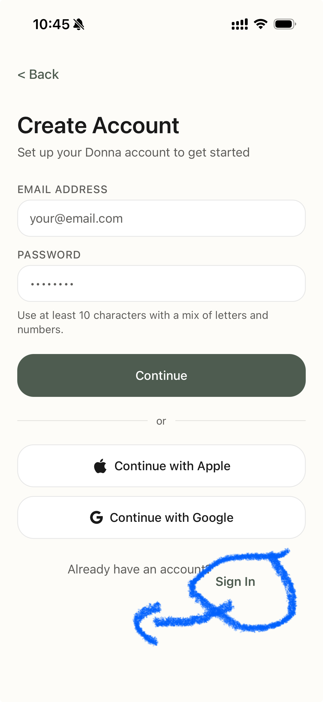
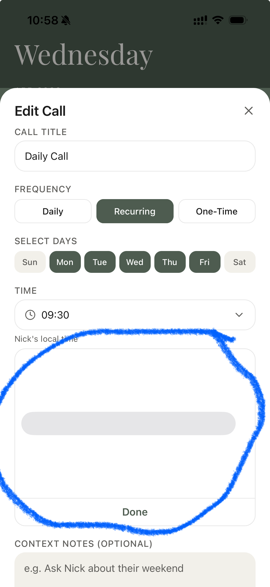

# Bug Tracker

## Open Bugs

### BUG-003: App auto-skips Get Started / Sign In page after ~1 second
- **Reported**: 2026-04-22
- **Reporter**: Nick
- **App**: Mobile (iOS)
- **Severity**: Critical — users never see the sign-in screen
- **Description**: When the user opens the app, even after force quitting it, after a ~1 second delay it automatically jumps past the Get Started / Sign In page. The user never gets a chance to interact with it.
- **Steps to Reproduce**:
  1. Force quit the app
  2. Reopen it
  3. The Get Started / Sign In page flashes for ~1 second then auto-navigates away
- **Expected**: The Get Started / Sign In page should remain until the user taps a button
- **Video**: See [bug-005-onboarding issues.MP4](screenshots/bug-005-onboarding%20issues.MP4) and [bug-005-onboarding issues v2.MP4](screenshots/bug-005-onboarding%20issues%20v2.MP4)

---

### BUG-004: Error when clicking "Go to Dashboard" after completing onboarding
- **Reported**: 2026-04-22
- **Reporter**: Nick
- **App**: Mobile (iOS)
- **Severity**: Critical — blocks user from reaching dashboard after onboarding
- **Description**: After filling out the entire onboarding flow, clicking to go to the dashboard triggers an error popup. The user is stuck on the success screen with no way to proceed.
- **Steps to Reproduce**:
  1. Complete the full onboarding flow
  2. Tap the button to go to the dashboard
  3. Error pops up
- **Expected**: User should navigate to the dashboard successfully
- **Video**: See [bug-005-onboarding issues.MP4](screenshots/bug-005-onboarding%20issues.MP4) and [bug-005-onboarding issues v2.MP4](screenshots/bug-005-onboarding%20issues%20v2.MP4)

---

### BUG-005: User data persists in onboarding fields after force quit
- **Reported**: 2026-04-22
- **Reporter**: Nick
- **App**: Mobile (iOS)
- **Severity**: Low — unconventional behavior, not strictly a bug
- **Description**: After force quitting the app, all the user data previously entered in the onboarding fields is still there. This is unconventional — most apps clear unsaved form data on force quit.
- **Steps to Reproduce**:
  1. Fill out some onboarding fields
  2. Force quit the app
  3. Reopen the app and navigate to onboarding
  4. All previously entered data is still populated
- **Expected**: Fields should either be cleared on force quit, or this should be an intentional "save draft" feature with clear UX indication
- **Video**: See [bug-005-onboarding issues.MP4](screenshots/bug-005-onboarding%20issues.MP4) and [bug-005-onboarding issues v2.MP4](screenshots/bug-005-onboarding%20issues%20v2.MP4)

---

### BUG-006: No splash screen while app loads
- **Reported**: 2026-04-22
- **Reporter**: Nick
- **App**: Mobile (iOS)
- **Severity**: Medium — polish / UX improvement
- **Description**: Ideally the app should show a splash screen upon opening while things load. The splash screen should be dark sage everywhere except for the Donna logo, which should be in the off-white color.
- **Expected**: A branded splash screen (dark sage background, off-white Donna logo) displays while the app initializes

---

### BUG-007: No "Done" button on iPhone keyboard during onboarding
- **Reported**: 2026-04-22
- **Reporter**: Nick
- **App**: Mobile (iOS)
- **Severity**: High — significant UX issue
- **Description**: After typing to fill out fields in the app, the keyboard that pops up on the iPhone has no "Done" button. Users have to tap random places on the screen to dismiss the keyboard so they can access the Continue button. This is a poor user experience — there should be a "Done" button or toolbar above the keyboard to dismiss it.
- **Steps to Reproduce**:
  1. Open the app and navigate to any onboarding field
  2. Tap a text field — keyboard appears
  3. No "Done" button is visible on the keyboard
  4. User must tap elsewhere on the screen to dismiss it
- **Expected**: A "Done" button (or input accessory toolbar) should appear above the keyboard, allowing users to dismiss it easily and access the Continue button
- **Video**: See [bug-005-onboarding issues.MP4](screenshots/bug-005-onboarding%20issues.MP4) and [bug-005-onboarding issues v2.MP4](screenshots/bug-005-onboarding%20issues%20v2.MP4)

---

### BUG-008: Instant Call button, Call Schedule button, and Power Bar text should be slightly lower
- **Reported**: 2026-04-22
- **Reporter**: Nick
- **App**: Mobile (iOS)
- **Severity**: Low — UI polish
- **Description**: The Instant Call button, Call Schedule button, and the words on the Power Bar (below their icons) should all be moved a tiny bit lower for better visual alignment.
- **Screenshot**: 

---

### BUG-009: Add "Myself" as an option for who Donna is for
- **Reported**: 2026-04-22
- **Reporter**: Nick
- **App**: Mobile (iOS)
- **Severity**: Medium — missing option in onboarding
- **Description**: When the user is asked who Donna is for during onboarding, "Myself" should be one of the available options. Currently it is not listed.
- **Screenshot**: 

---

### BUG-010: Sign In button should be centered below "Already have an account?"
- **Reported**: 2026-04-22
- **Reporter**: Nick
- **App**: Mobile (iOS)
- **Severity**: Low — UI polish
- **Description**: On the initial/Get Started page, the Sign In button should be positioned below the "Already have an account?" text and centered on the screen.
- **Screenshot**: 

---

### BUG-011: Call times not visible in dark mode when scheduling a call
- **Reported**: 2026-04-22
- **Reporter**: Nick
- **App**: Mobile (iOS)
- **Severity**: High — content invisible to dark mode users
- **Description**: When the user has dark mode enabled on their iPhone, the call times are not visible when scheduling a call. The text likely blends into the background.
- **Screenshot**: 

---

### Note: Splash Screen Draft Available
- **Date**: 2026-04-22
- **Description**: This image can be used as a splash screen if needed (dark sage background, off-white Donna logo). Relates to BUG-006.
- **Image**: 

---

## Resolved Bugs

### BUG-001: Signup rejects all passwords as "found in data leak"
- **Reported**: 2026-04-13
- **Resolved**: 2026-04-14
- **Reporter**: Nick
- **App**: Mobile (consumer signup)
- **Severity**: Critical — blocks new user registration
- **Description**: When creating an account, every password entered is rejected with a message saying it was "found in data leak" and that a different password must be used. After 7+ attempts with different passwords, none were accepted. This effectively prevents any new user from signing up.
- **Steps to Reproduce**:
  1. Open the app and begin account creation
  2. Enter email and any password
  3. Password is rejected as "found in data leak"
  4. Try different passwords — all rejected
- **Expected**: Valid, strong passwords should be accepted
- **Screenshot**: 
- **Fix branch**: `codex/mobile-onboarding-bugs`
- **Status**: Fixed in `codex/mobile-onboarding-bugs` — restores native strong-password support, raises local minimum length, improves breached-password guidance, and updates mobile auth E2E passwords to be unique per run.

---

### BUG-002: "Continue to Homepage" fails after completing signup
- **Reported**: 2026-04-13
- **Resolved**: 2026-04-14
- **Reporter**: Nick
- **App**: Mobile (onboarding success screen)
- **Severity**: Critical — blocks onboarded users from reaching the app
- **Description**: After completing the full signup/onboarding flow and reaching the success screen, tapping "Continue to Homepage" displays the error: "Failed to complete onboarding. Please try again." Retrying does not resolve the issue. There is no back button or alternative navigation, so the user is completely stuck on this screen with no way to proceed or go back.
- **Steps to Reproduce**:
  1. Complete full signup and onboarding flow
  2. Reach the success/congratulations screen
  3. Tap "Continue to Homepage"
  4. Error appears: "Failed to complete onboarding. Please try again"
  5. Tapping again produces the same error
- **Expected**: User should be navigated to the main dashboard. If an error occurs, there should be a way to go back or clear guidance on the issue.
- **Screenshot**: 
- **Fix branch**: `codex/mobile-onboarding-bugs`
- **Status**: Fixed in `codex/mobile-onboarding-bugs` — aligns mobile call-schedule payloads with backend validation, prevents empty recurring schedules, and makes backend onboarding writes transactional.

## Facundo QA TODOs

- [ ] **BUG-001 signup password check**: Create a fresh mobile account on an iPhone/simulator and confirm the password field offers or accepts a strong password instead of repeatedly showing Clerk's "found in data leak" rejection.
- [ ] **BUG-002 full onboarding completion**: Complete all five onboarding steps, tap "Continue to Homepage", and confirm the app creates the senior, links the caregiver, creates reminders, and lands on the dashboard.
- [ ] **Recurring schedule validation**: On the Schedule Donna step, choose "Recurring" without selecting any day and confirm the app blocks progress with "Choose at least one day for this recurring call."
- [ ] **Duplicate loved-one phone recovery**: Try onboarding with a loved-one phone number already used by another senior and confirm the app shows the duplicate-phone message rather than the generic onboarding failure.
