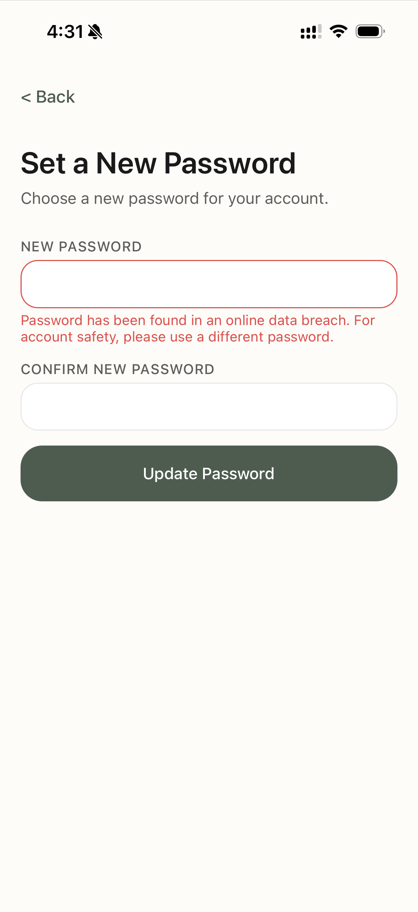
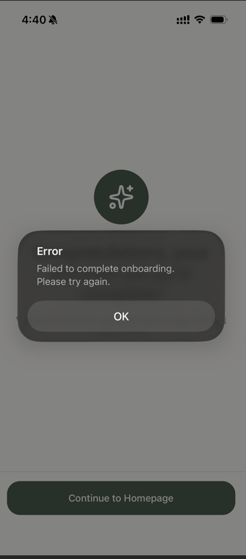

# Bug Tracker

## Open Bugs

(none)

---

## Resolved Bugs

### BUG-001: Signup rejects all passwords as "found in data leak"
- **Reported**: 2026-04-13
- **Resolved**: 2026-04-14
- **Reporter**: Nick
- **App**: Mobile (consumer signup)
- **Severity**: Critical — blocks new user registration
- **Description**: When creating an account, every password entered is rejected with a message saying it was "found in a data leak" and that a different password must be used. After 7+ attempts with different passwords, none were accepted. This effectively prevents any new user from signing up.
- **Steps to Reproduce**:
  1. Open the app and begin account creation
  2. Enter email and any password
  3. Password is rejected as "found in a data leak"
  4. Try different passwords — all rejected
- **Expected**: Valid, strong passwords should be accepted
- **Screenshot**: 
- **Fix branch**: `codex/mobile-onboarding-bugs`
- **Status**: Fixed in `codex/mobile-onboarding-bugs` — restores native strong-password support, raises local minimum length, improves breached-password guidance, and updates mobile auth E2E passwords to be unique per run.

---

### BUG-002: "Continue to Homepage" fails after completing signup
- **Reported**: 2026-04-13
- **Resolved**: 2026-04-14
- **Reporter**: Nick
- **App**: Mobile (onboarding success screen)
- **Severity**: Critical — blocks onboarded users from reaching the app
- **Description**: After completing the full signup/onboarding flow and reaching the success screen, tapping "Continue to Homepage" displays the error: "Failed to complete onboarding. Please try again." Retrying does not resolve the issue. There is no back button or alternative navigation, so the user is completely stuck on this screen with no way to proceed or go back.
- **Steps to Reproduce**:
  1. Complete full signup and onboarding flow
  2. Reach the success/congratulations screen
  3. Tap "Continue to Homepage"
  4. Error appears: "Failed to complete onboarding. Please try again"
  5. Tapping again produces the same error
- **Expected**: User should be navigated to the main dashboard. If an error occurs, there should be a way to go back or clear guidance on the issue.
- **Screenshot**: 
- **Fix branch**: `codex/mobile-onboarding-bugs`
- **Status**: Fixed in `codex/mobile-onboarding-bugs` — aligns mobile call-schedule payloads with backend validation, prevents empty recurring schedules, and makes backend onboarding writes transactional.

## Facundo QA TODOs

- [ ] **BUG-001 signup password check**: Create a fresh mobile account on an iPhone/simulator and confirm the password field offers or accepts a strong password instead of repeatedly showing Clerk's "found in data leak" rejection.
- [ ] **BUG-002 full onboarding completion**: Complete all five onboarding steps, tap "Continue to Homepage", and confirm the app creates the senior, links the caregiver, creates reminders, and lands on the dashboard.
- [ ] **Recurring schedule validation**: On the Schedule Donna step, choose "Recurring" without selecting any day and confirm the app blocks progress with "Choose at least one day for this recurring call."
- [ ] **Duplicate loved-one phone recovery**: Try onboarding with a loved-one phone number already used by another senior and confirm the app shows the duplicate-phone message rather than the generic onboarding failure.
